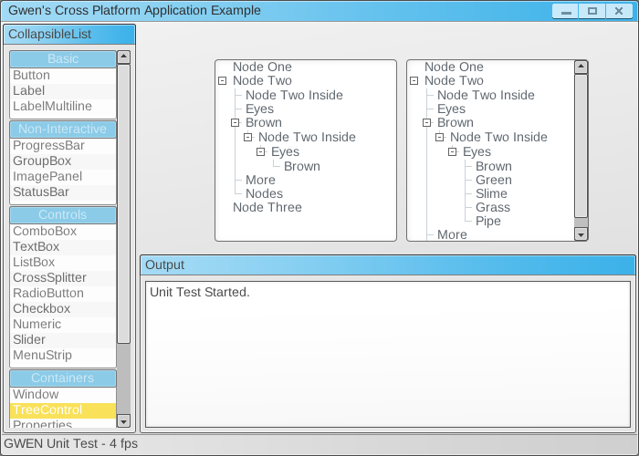

# GWEN: GUI without Extravagant Nonsense

A cross-platform C++ GUI framework tested to work on both Linux (Ubuntu variants) and Windows. Designed to just work and need as few dependencies as reasonable. Originally created by Garry Newman.



Supports multiple renderer backends, but OpenGL is by far best supported.

## Required Dependencies

Windows: freeimage (already included)
Linux: libxcursor-dev mesa-common-dev libgui1-mesa-dev libfreeimage-dev libglewmx-dev

## Install and Build Instructions

These instructions work on both Windows and Linux as long as you have git installed

```bash
# Likely not necessary if you've done stuff like this before, not necessary (or possible) on Windows
sudo apt-get install build-essential git

# Install dependencies (for Linux)
sudo apt-get install libxcursor-dev mesa-common-dev libgui1-mesa-dev libfreeimage-dev libglewmx-dev

# Clone the repository and change directory into it
git clone https://github.com/matt-attack/GWEN.git
cd GWEN/gwen

# Build the respository
cmake .
cmake --build .
```
